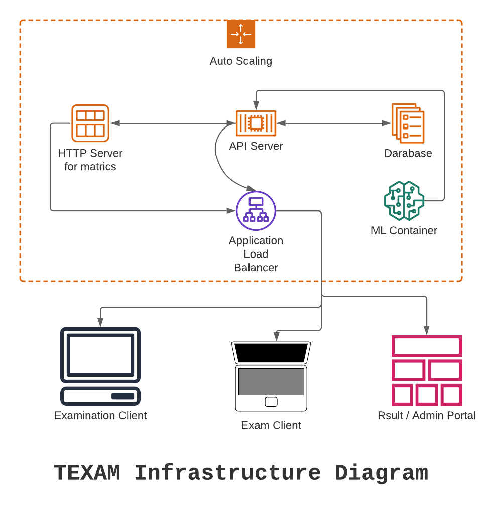

# TEXAM

## Doccumentation

> This site is a prototype API for online assisment and forms collection

## Download Client 
- [Download Latest automated build](https://github.com/harshsinghvi/texam/releases/download/latest/quiz-windows.exe)
- [Download Latest stable build](https://github.com/harshsinghvi/texam/releases/download/stable/quiz-windows.exe)

### Use Following Resources:- 

* /questions
* /store-responses
* /get-data
* /test-connection
* /scores
* /delete   
* /responses
* /delete-sample-data

## Resources:
- https://blog.learningdollars.com/2019/11/29/how-to-serve-a-reactapp-with-a-flask-server/
